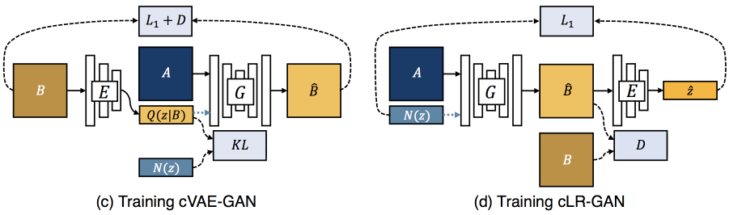

# BicycleGAN implementation in Tensorflow

As part of the implementation series of [Joseph Lim's group at USC](http://csail.mit.edu/~lim), our motivation is to accelerate (or sometimes delay) research in the AI community by promoting open-source projects. To this end, we implement state-of-the-art research papers, and publicly share them with concise reports. Please visit our [group github site](https://github.com/gitlimlab) for other projects.

This project is implemented by [Youngwoon Lee](https://github.com/youngwoon) and the codes have been reviewed by [Temporary]() before being published.

## Description

This repo is a [Tensorflow](https://www.tensorflow.org/) implementation of BicycleGAN on Pix2Pix datasets: [Toward Multimodal Image-to-Image Translation](http://papers.nips.cc/paper/6650-toward-multimodal-image-to-image-translation).

This paper presents a framework addressing the **image-to-image translation** task, where we are interested in converting an image from one domain (e.g., sketch) to another domain (e.g., image). While the previous method (pix2pix) cannot generate diverse output, this paper proposes a method that one image (e.g., a sketch of shoes) can be transformed into a set of images (e.g., shoes with different colors).

The proposed method encourages diverse results by generating output images with noise and then reconstructing noise from the output images. The framework consists of two cycles, noise *z* -> output *B'* -> noise *z'* and *B* -> *z'* -> *B'*.

The first step is conditional Variational Auto Encoder GAN (cVAE-GAN) which is pix2pix network with noise. In cVAE-GAN, a generator *G* takes an input image *A* (sketch) and a noise *z* and outputs its counterpart in domain *B* (image) with variations. However, it was reported that the generator *G* ends up with ignoring the added noise.

The second part, conditional Latent Regressor GAN (cLR-GAN), enforces the generator to follow the noise *z*. An encoder *E* maps visual features (color and texture) of a target image *B* to the latent vector *z'* which is close to an original noise *z*. To minimize |*z*-*z'*|, images computed with different noises should be different.  Therefore, the cLR-GAN can alleviate the issue of mode collapse. Moreover, a KL-divergence loss *KL(p(z);N(0;I))* encourages the latent vectors to follow gaussian distribution, so a gaussian noise can be used in testing time.



## Dependencies

- Ubuntu 16.04
- Python 2.7
- [Tensorflow 1.1.0](https://www.tensorflow.org/)
- [NumPy](https://pypi.python.org/pypi/numpy)
- [SciPy](https://pypi.python.org/pypi/scipy)
- [Pillow](https://pillow.readthedocs.io/en/4.0.x/)
- [tqdm](https://github.com/tqdm/tqdm)
- [h5py](http://docs.h5py.org/en/latest/)

## Usage

- Execute the following command to download the specified dataset as well as train a model:

```
$ python bicycle-gan.py --task edges2shoes --image_size 256
```

- To reconstruct 256x256 images, set `--image_size` to 256; otherwise it will resize to and generate images in 128x128.
  Once training is ended, testing images will be converted to the target domain and the results will be saved to `./results/edges2shoes_2017-07-07_07-07-07/`.
- Available datasets: edges2shoes, edges2handbags, maps, cityscapes, facades


- Check the training status on Tensorboard:

```
$ tensorboard --logdir=./logs
```

## Results

### edges2shoes


### day2night


## References

- [Toward Multimodal Image-to-Image Translation](http://papers.nips.cc/paper/6650-toward-multimodal-image-to-image-translation)
- [Unpaired Image-to-Image Translation using Cycle-Consistent Adversarial Networks](https://arxiv.org/abs/1703.10593)
- [Instance Normalization: The Missing Ingredient for Fast Stylization](https://arxiv.org/abs/1607.08022)
